# Progettazione — Console di pianificazione turni portuali

Traccia 3 · *Pianificazione turni* · **Elia Strazzella & Matteo Aloè**
Laboratorio di Interfaccia Uomo-Macchina · A.A. 2025/2026

**Mockup Figma:** [Gestione Turni Portuale](https://www.figma.com/design/0S4a1ERsyN2PjAxRbxvrqZ/Gestione-Turni-Portuale?node-id=0-1&t=G2k0YprMbRFiwrFc-1)
**Codice e avvio:** [`../README.md`](../README.md) · [`../AVVIA-QUI.md`](../AVVIA-QUI.md)

Questa pagina raccoglie il lavoro fatto **prima e intorno al codice**: come abbiamo
riformulato il problema, per chi abbiamo progettato, cosa abbiamo disegnato, cosa
abbiamo buttato via e perché. Le immagini sono ritagli della tavola Figma e delle
schede di valutazione; la tavola completa è in
[`Gestione Turni Portuale.png`](Gestione%20Turni%20Portuale.png).

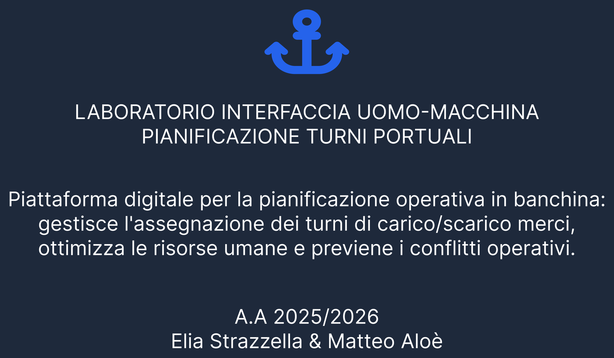

---

## 1. Il problema, e come l'abbiamo riformulato

La traccia chiede di comporre la turnazione degli addetti alla ricezione merci,
verificando il carico orario di ciascun dipendente. Il primo rombo del processo è
servito proprio a **non accettare quella formulazione così com'era**.

Osservando il contesto portuale è emerso che comporre il piano a tavolino non è la
parte difficile: si fa una volta, con calma. Il momento in cui il coordinatore soffre
è quando il piano **salta** — una nave arriva in ritardo e va rifatto l'incastro di
corsa, rispettando contratti, abilitazioni di banchina e riposi obbligatori.

> **L'insight, dopo la convergenza:**
> «Il coordinatore non fatica a inserire i turni: fatica a capire in fretta chi può
> coprire un buco.»

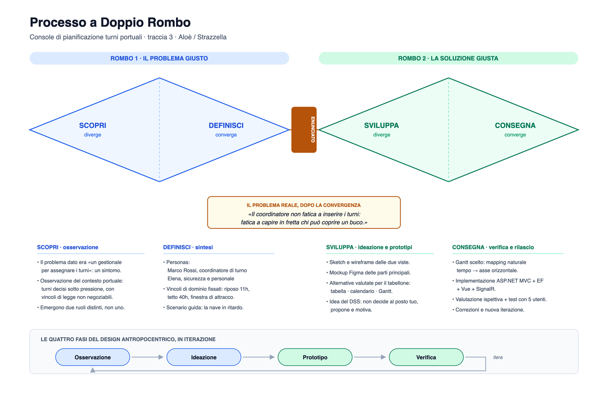

Da quella riformulazione discende tutto il resto: il sistema non è un gestionale di
inserimento dati, è un **sistema di supporto alle decisioni** che deve rendere
leggibile, in pochi secondi, chi è utilizzabile e a quale costo.

Sono anche emersi **due ruoli distinti, non uno**: chi compone i turni sotto pressione
e chi presidia le regole entro cui quei turni si compongono.

---

## 2. Per chi: le due personas

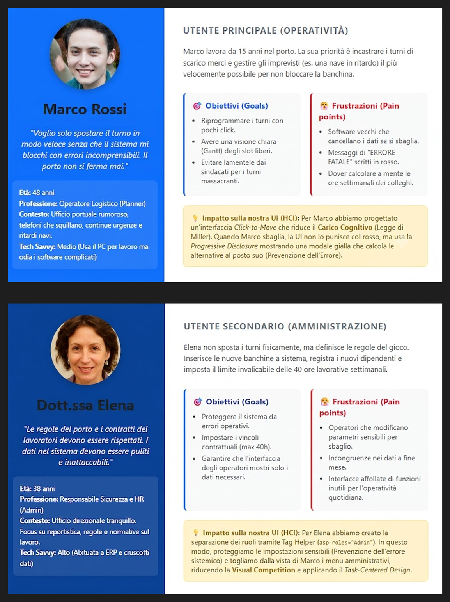

**Marco Rossi**, 48 anni, operatore logistico. Ufficio rumoroso, telefoni che
squillano, urgenze continue. Dimestichezza media con il PC e insofferenza dichiarata
per i software complicati:

> «Voglio solo spostare il turno in modo veloce senza che il sistema mi blocchi con
> errori incomprensibili. Il porto non si ferma mai.»

I suoi *pain point* sono espliciti e hanno guidato scelte precise: software che
cancellano i dati se si sbaglia, messaggi di «ERRORE FATALE» scritti in rosso, dover
calcolare a mente le ore settimanali dei colleghi. Per Marco la console riduce il
carico cognitivo (Legge di Miller), non punisce l'errore col rosso e usa la
*progressive disclosure* per mostrare le alternative al posto suo.

**Dott.ssa Elena**, 38 anni, responsabile sicurezza e HR. Non sposta i turni: definisce
le regole del gioco — vincoli contrattuali, tetto delle 40 ore, dati puliti. Da qui la
**separazione dei due ambienti**: gli strumenti di amministrazione non compaiono nella
console di Marco, riducendo la *visual competition* e proteggendo le impostazioni
sensibili. La separazione è realizzata col tag helper `asp-roles="Admin"` — che non
emette nemmeno il markup riservato — **ed è verificata anche sul server** con
`[Authorize(Roles = "Admin")]`: nascondere un comando non lo protegge.

---

## 3. Obiettivi di usabilità

Fissati prima di disegnare, per avere qualcosa di falsificabile durante il test.

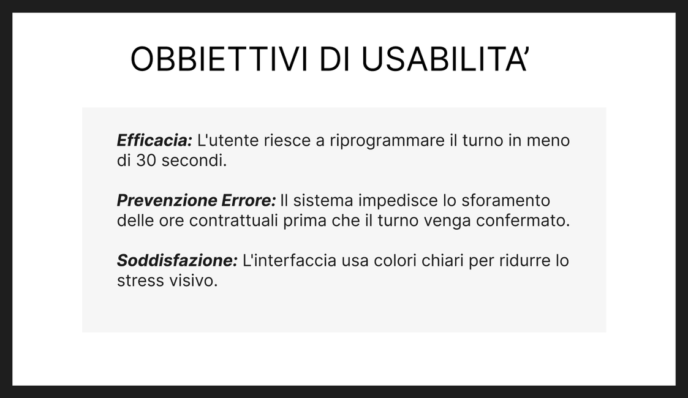

| | Obiettivo |
|---|---|
| **Efficacia** | riprogrammare un turno in meno di 30 secondi |
| **Prevenzione dell'errore** | il sistema impedisce lo sforamento delle ore contrattuali *prima* che il turno venga confermato |
| **Soddisfazione** | colori chiari, per ridurre lo stress visivo in un turno lungo |

---

## 4. Come si svolge il lavoro: il caso d'uso

Lo scenario guida di tutto il progetto: la nave *Athena* arriva in ritardo.

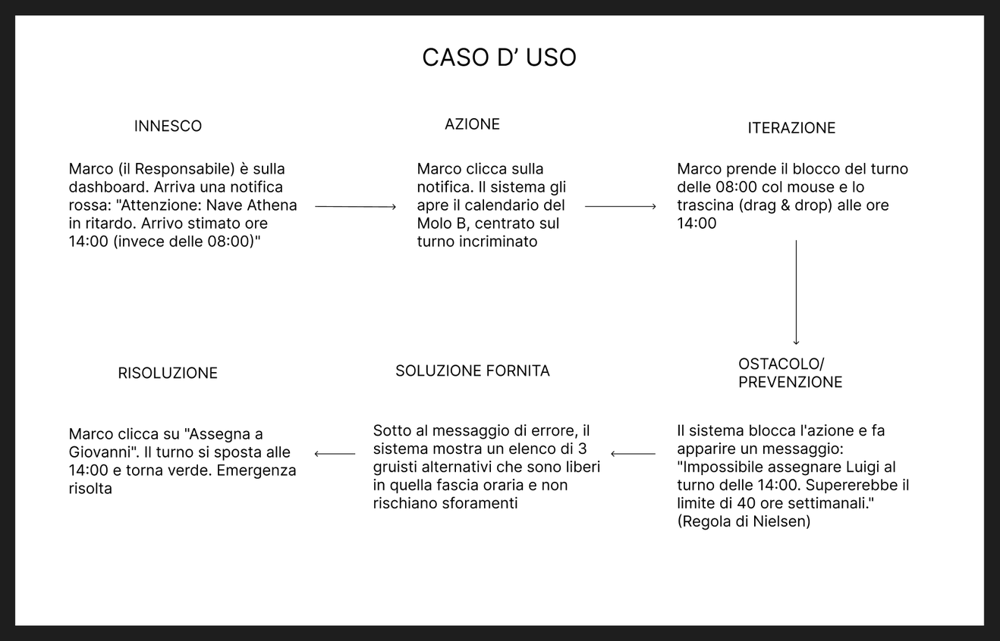

Il passaggio che conta è il quarto, **OSTACOLO / PREVENZIONE**: il sistema non lascia
salvare e non si limita a dire di no — spiega *quale* vincolo si sta violando
(«Supererebbe il limite di 40 ore settimanali») e subito sotto elenca chi, invece,
è utilizzabile in quella fascia. È la differenza fra un messaggio d'errore e una
via d'uscita.

### Lo stesso caso, come processo utente/sistema

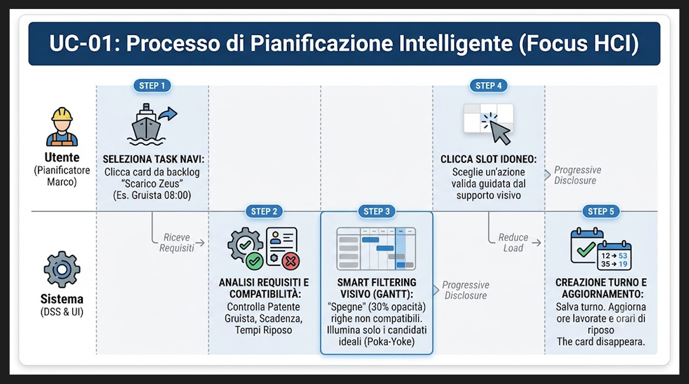

Cinque passi, divisi fra ciò che fa l'utente e ciò che fa il sistema. Lo **Step 3** è
il cuore HCI: il sistema non filtra via i non idonei, li *attenua* — e la scelta di
attenuare invece di nascondere è quella che il test ci ha fatto rivedere (§ 6).

---

## 5. Cosa succede dietro: il service blueprint

Il caso d'uso dice cosa vede l'utente. Il blueprint serve a **mappare anche le azioni
invisibili**, front-stage e back-stage, per isolare l'esatto momento in cui
l'interfaccia deve intervenire.

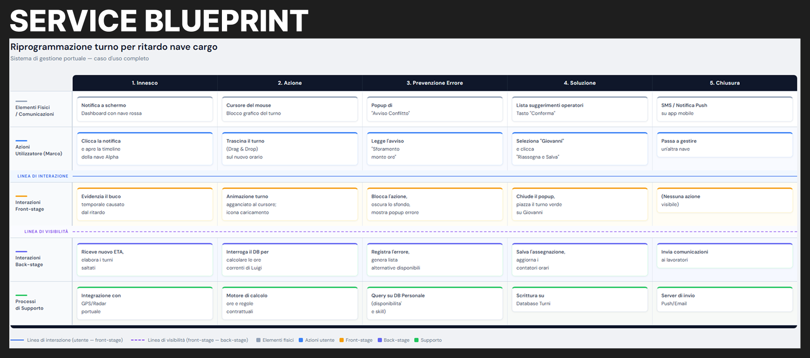

Le cinque fasi — *innesco, azione, prevenzione errore, soluzione, chiusura* — attraversano
la linea di interazione e la linea di visibilità: dalla notifica a schermo fino all'SMS
di conferma agli operatori coinvolti, passando per il motore di calcolo ore e le regole
contrattuali. È da questo esercizio che è nato il **registro delle comunicazioni**
presente nella console: la chiusura del servizio non è il salvataggio, è avvisare le
persone.

---

## 6. Linguaggio visivo

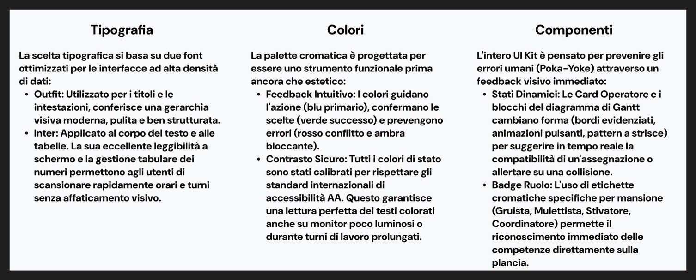

Tre scelte, tutte funzionali prima che estetiche:

- **Tipografia** — *Outfit* per titoli e intestazioni, *Inter* per il corpo e le
  tabelle: la sua gestione tabulare dei numeri permette di scandire orari e turni
  senza affaticamento.
- **Colori** — guidano l'azione (blu), confermano (verde), prevengono (rosso e ambra),
  con contrasto calibrato sullo standard **AA**: la console si legge anche su monitor
  poco luminosi.
- **Componenti** — pensati per il *poka-yoke*: le card operatore e i blocchi del
  tabellone cambiano forma per suggerire in tempo reale la compatibilità di
  un'assegnazione.

Nessuna informazione è affidata al solo colore: ritardi e conflitti hanno sempre
un'etichetta scritta accanto.

**Il ruolo non è un colore, è un pittogramma.** Gruista, mulettista e stivatore avevano
in origine tre tinte diverse. Le abbiamo tolte: sul tabellone il colore deve poter dire
*«si può»* e *«non si può»*, e se dice anche *«stivatore»* smette di dire l'una cosa e
l'altra. La qualifica è passata a un badge grigio con un pittogramma del mestiere — si
riconosce comunque a colpo d'occhio, ma senza consumare uno dei pochi significati che il
colore può portare senza ambiguità.

---

## 7. Tre prototipi, e uno scartato

### Prototipo 1 — scartato

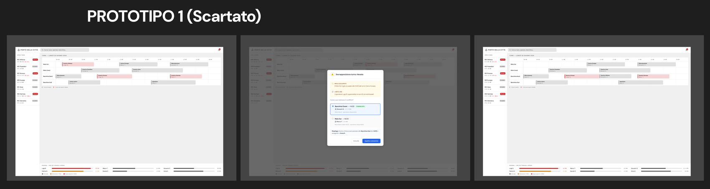

La prima ipotesi affidava la modifica del turno a una **finestra modale**. Provandola
sul flusso del caso d'uso il difetto è venuto fuori subito: la modale **oscurava il
tabellone sottostante**, cioè proprio il contesto che serve per decidere. Il
coordinatore doveva ricordare a memoria la situazione del porto mentre scegliva —
violazione diretta di *«riconoscimento piuttosto che ricordo»* (Nielsen #6).

Averlo scartato per una ragione dichiarabile, e non per gusto, è il motivo per cui
questo prototipo è rimasto nella tavola invece di essere cancellato.

### Prototipo 2

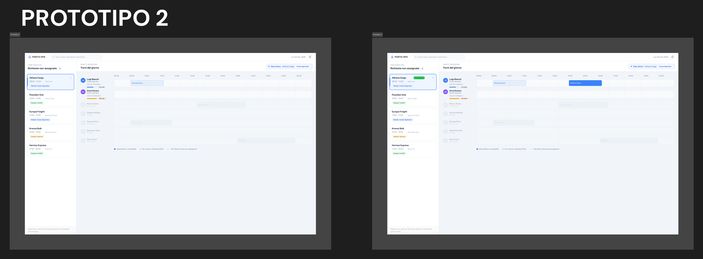

Eliminato il blocco visivo: layout integrato, si opera sui dettagli mantenendo sempre
visibile il contesto globale della pianificazione. È la versione portata al test con
gli utenti insieme alla prima.

### Prototipo 3 — quello implementato

Quattro decisioni separano il mockup V2 dal prototipo funzionante.

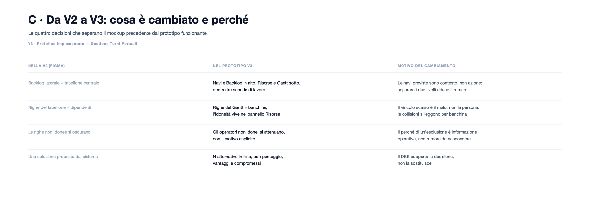

La più strutturale è la seconda: **le righe del tabellone sono le banchine, non i
dipendenti**. Con una riga per persona, due navi sulla stessa banchina non producevano
nessun segnale visibile di collisione; il vincolo scarso al porto è il molo, non la
persona, e le collisioni devono leggersi dove avvengono davvero.

#### La maschera di lavoro

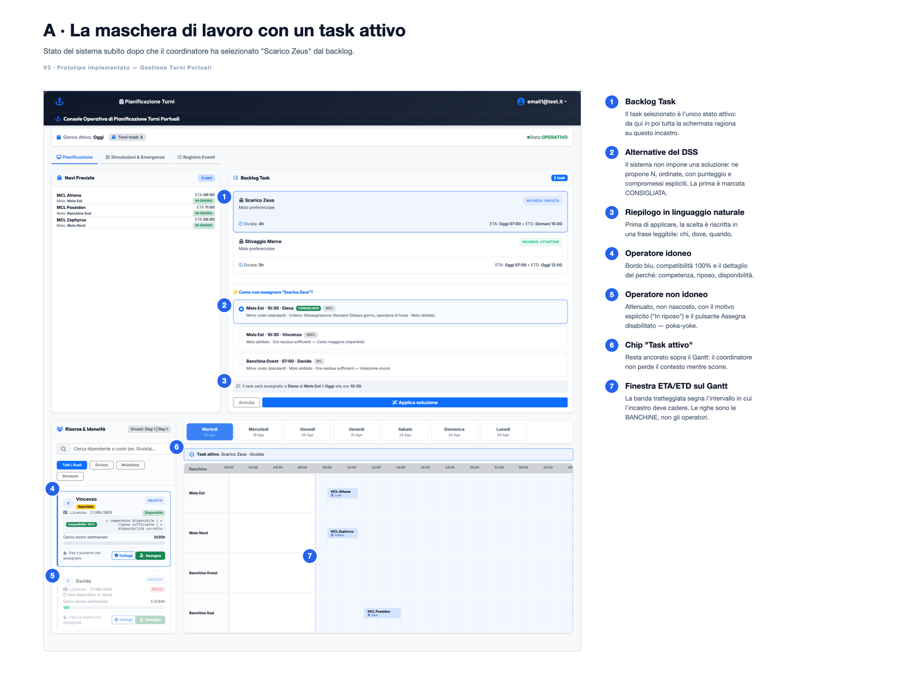

#### Le due scelte di supporto visivo

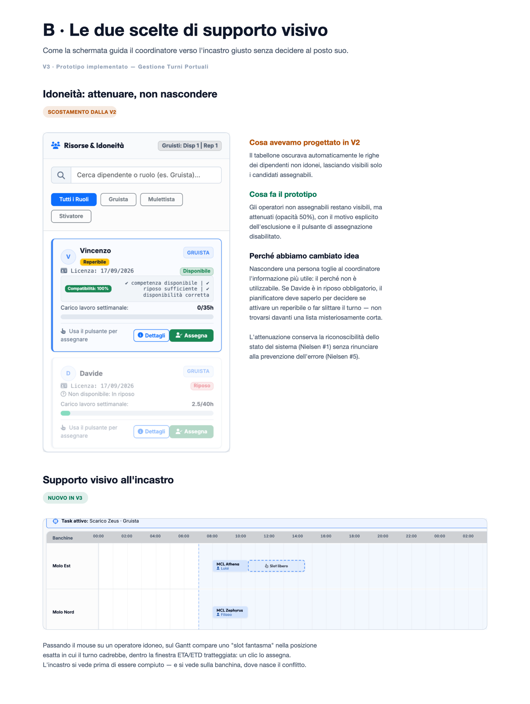

**Idoneità: attenuare, non nascondere.** In V2 il tabellone oscurava le righe dei non
idonei, lasciando visibili solo i candidati assegnabili. Nel prototipo restano visibili
ma attenuati, con il motivo esplicito accanto («In riposo obbligatorio», «Patente
scaduta»). Nascondere una persona toglie al coordinatore l'informazione più utile —
*perché* non è utilizzabile: se Davide è in riposo obbligatorio, il pianificatore deve
saperlo per decidere se attivare un reperibile o far slittare il turno, non trovarsi
davanti una lista misteriosamente corta. L'attenuazione conserva la visibilità dello
stato del sistema (Nielsen #1) senza rinunciare alla prevenzione dell'errore (Nielsen #5).

L'organico ha una **scheda propria**, separata dalla maschera di lavoro. È una scheda di
consultazione — «con chi posso contare oggi» — e non ha nessun pulsante *Assegna*: non
c'è nessuna lavorazione selezionata a cui assegnare. Scegliere la persona è compito delle
proposte del DSS, dove la scelta si vede insieme al suo effetto sul tabellone. Tenere le
due cose separate ha liberato la maschera di lavoro, che ora ospita solo i due oggetti del
compito: le lavorazioni in attesa e il tabellone.

#### Le anteprime: vedere dove c'è posto senza scegliere niente

Una prima versione mostrava dove sarebbe caduto il turno **passando il mouse** su un
candidato: rispondeva a *«dove finirebbe questo turno?»*, ma solo dopo che una
lavorazione era già stata scelta, e solo finché si teneva il mouse fermo. La domanda che
il coordinatore si fa entrando è un'altra, e viene prima: *«dove c'è posto, questa
settimana?»*.

Per questo il tabellone mostra, **senza che si selezioni nulla e senza dover puntare
niente**, un blocco tratteggiato
per ogni lavorazione ancora da assegnare, nel primo molo e nella prima ora liberi dentro
la sua finestra di attracco. Le anteprime si collocano una dopo l'altra tenendo conto di
quelle già disposte, così non si accavallano tutte sullo stesso slot raccontando una
disponibilità che non c'è.

L'asse copre l'intera settimana — 168 ore in continuo — e il selettore dei giorni fa
scorrere il tabellone invece di filtrarlo: la settimana è sempre tutta lì, e non serve
«entrare» in un giorno alla volta per scoprire dove ci sarebbe spazio. È il principio del
*riconoscimento piuttosto che ricordo* (Nielsen #6) applicato alla capienza del porto.

#### Una nave, più persone: la squadra

Uno scarico non lo fa una persona sola. Una lavorazione dichiara **quante persone le
servono**, e il turno singolo diventa un caso particolare della squadra (`n = 1`).

La squadra non è un'entità a sé: è l'insieme dei turni nati dalla stessa lavorazione, sullo
stesso molo e nella stessa fascia. Il primo assegnato fissa dove e quando; per i successivi
il sistema non cerca più uno slot ma solo la persona, e propone l'*affiancamento alla
squadra già sul posto*.

Due conseguenze, entrambe volute:

- **La copertura parziale non è un successo.** Finché mancano persone la lavorazione
  **resta nell'elenco** con il conteggio (`1/2`), e sul tabellone il posto scoperto è
  occupato da una corsia tratteggiata *«Manca · Gruista»*, cliccabile per completare la
  squadra. Una nave a metà equipaggio non deve poter sparire dalla vista solo perché
  qualcuno ci è già stato messo.
- **Annullare non distrugge.** Togliendo una persona da una squadra completa la
  lavorazione ritorna in elenco con la copertura giusta, e il posto vacante ricompare
  dov'era. Nessuna assegnazione è definitiva, e niente si perde per strada.

#### Le proposte a lato, non in mezzo

Le alternative del DSS erano nate sotto l'elenco delle lavorazioni: aprendosi spingevano
il tabellone in basso proprio mentre serviva guardarlo. Portate in una colonna della
griglia, lo restringevano a ogni selezione — la tela larga oltre cinquemila pixel si
ridisegnava sotto gli occhi.

Ora entrano da destra in un **pannello laterale sovrapposto**, senza velo scuro: il
tabellone resta della sua dimensione, visibile e utilizzabile accanto alle proposte. Non è
un ritorno al Prototipo 1 — quello fu scartato perché la modale **oscurava** il contesto e
obbligava a ricordarlo a memoria; qui il contesto non viene né coperto né spostato.

#### Che cosa dice la percentuale

Accanto a ogni proposta c'è un numero, e deve essere **leggibile come una somma di
rinunce**, non come un voto. Si parte da cento e si sottrae per ogni compromesso che la
collocazione impone, con i pesi ordinati come i criteri del motore: un operatore a
chiamata costa più di uno di linea, far aspettare la nave al giorno dopo costa più che
usare un reperibile, uno straordinario dichiarato costa più di uno slittamento, e la
deroga di qualifica — mandare qualcuno su un molo per cui non è abilitato — costa più
di uno straordinario. Il carico contrattuale entra in proporzione: è il criterio con cui
il motore stesso rompe la parità, e serve a distinguere due candidati identici in tutto
il resto.

Ogni sottrazione compare a parole nella riga sotto: se il numero scende, accanto c'è
scritto perché. **Zero non appartiene a questa scala** — è riservato alle collocazioni
che il server rifiuterebbe, marcate *Non applicabile* e non selezionabili. La distinzione
è quella fra «si può fare, ma costa» e «non si può fare», e confonderle toglierebbe a chi
pianifica l'informazione più importante delle due.

#### Gli altri due ambienti

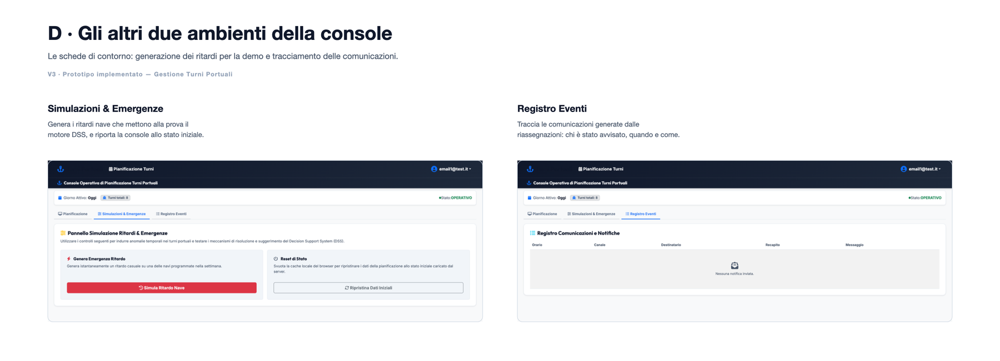

---

## 8. Valutazione

Le due famiglie di metodi sono state usate entrambe, perché non si sostituiscono:
l'**ispezione** trova a costo quasi zero le violazioni di regole note, il **test con le
persone** trova quello che le regole non prevedono.

### Test con utenti — metodo empirico

Cinque partecipanti, *think aloud* (Clayton Lewis), uno alla volta, sui Prototipi 1 e 2.
Cinque perché con L ≈ 31% la formula `N = 1 − (1 − L)ⁿ` copre circa l'**85%** dei
problemi: i dieci utenti in più arriverebbero al 100% aggiungendo solo ~15%.
Protocollo completo, script del facilitatore e griglia di osservazione:
[`test-usabilita.md`](test-usabilita.md).

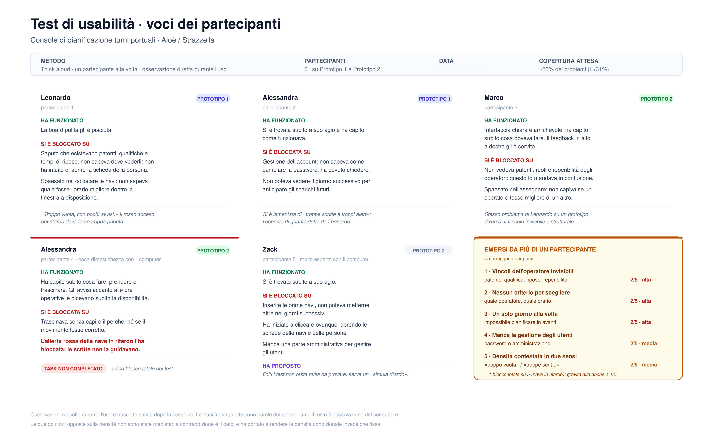

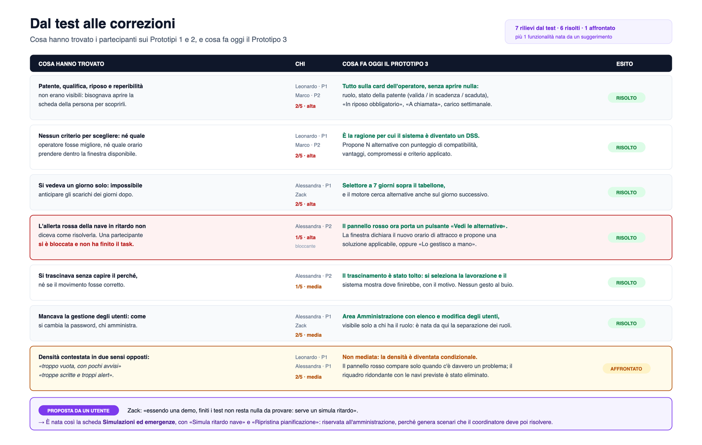

### Valutazione ispettiva — metodo analitico

Eseguita sull'applicazione reale misurando percorsi e stato del DOM, viewport 1440×900
e 375×812, dati riportati allo stato iniziale prima di ogni prova.

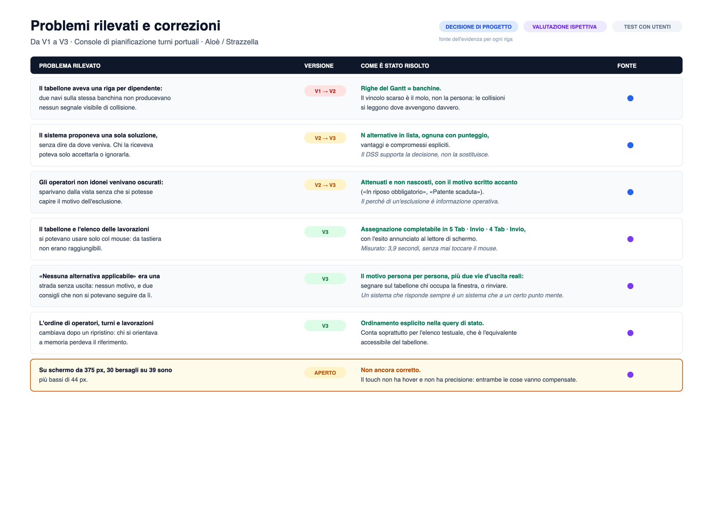

### I reperti, e cosa ne è stato

| # | Reperto | Gravità | Stato |
|---|---|---|---|
| **R1** | L'ordine di operatori, turni e lavorazioni non era deterministico: dopo un ripristino le liste si ripresentavano rimescolate | media | **corretto** — ordinamento esplicito nella query di stato |
| **R2** | Su schermo da 375 px, 30 bersagli su 39 sono più bassi di 44 px | media | **aperto** |
| **R3** | Un'azione riservata chiamata senza intestazione AJAX viene rediretta a una pagina di rifiuto che non esiste (in uso normale risponde 403) | bassa | **aperto** |
| **R4** | Un'assegnazione non si poteva disfare: l'annullamento esisteva solo per i turni già in crisi | alta | **corretto** — ogni turno apre la propria scheda, in *revisione* se è regolare |
| **R5** | L'annullamento di un turno eseguiva senza conferma, e il turno spariva invece di tornare in elenco | alta | **corretto** — conferma in due passi che elenca gli effetti; la lavorazione torna sempre nel backlog |

Il dettaglio di ciascun reperto, con la misura, è nell'allegato di
[`test-usabilita.md`](test-usabilita.md).

---

## 9. Dal disegno al codice

Le decisioni di progettazione hanno un punto preciso nel codice, così che siano
verificabili e non soltanto dichiarate.

| Decisione | Dove vive |
|---|---|
| I vincoli di dominio in un posto solo (riposo 11h, tetto 40h, finestra di attracco) | `src/Template/Services/PianificazioneTurni/RegolePianificazione.cs` |
| Il motore a sette criteri, che deroga solo quando i criteri meno invasivi hanno già fallito e dichiara sempre quale ha usato | `src/Template/Services/Shared/CalcolaMigliorAlternativaQuery.cs` |
| Nessun comando si fida del client: rilettura dal database e rivalidazione prima di scrivere | `src/Template/Services/PianificazioneTurni/PianificazioneTurni.Commands.cs` |
| Separazione dei due ambienti, in pagina e sul server | `src/Template.Web/Features/PianificazioneTurni/Index.cshtml`, `TurniController.cs` |
| Attenuazione con il motivo, conferme in due passi | `src/Template.Web/Features/PianificazioneTurni/_TabRisorse.cshtml`, `_ModaleConflitto.cshtml` |
| La squadra come insieme di turni fratelli: il fabbisogno sulla lavorazione, la copertura ricavata dai turni, il primo assegnato che fissa molo e ora | `src/Template/Services/Shared/TaskDaAssegnare.cs`, `PianificazioneTurni.Commands.cs`, `CalcolaMigliorAlternativaQuery.cs` (`AffiancaAllaSquadraAsync`) |
| Anteprime di tutta la settimana senza selezionare nulla, e la corsia tratteggiata del posto ancora scoperto | `src/Template.Web/Features/PianificazioneTurni/Index.Gantt.ts` (`anteprimeSettimana`, `postiVacantiPerBanchina`) |
| Le proposte a lato senza spostare il tabellone, aperte e chiuse seguendo la lavorazione scelta | `src/Template.Web/Features/PianificazioneTurni/_PannelloDSS.cshtml`, `Index.Modali.ts` (`sincronizzaPannelloDSS`) |

---

## 10. Contenuto della cartella

| File | Cosa è |
|---|---|
| [`Gestione Turni Portuale.png`](Gestione%20Turni%20Portuale.png) | la tavola Figma completa, esportata a piena larghezza (32768 × 11692 px): archivio di tutto il disegnato. A questa dimensione l'anteprima di GitHub non la mostra — va aperta in locale o guardata su [Figma](https://www.figma.com/design/0S4a1ERsyN2PjAxRbxvrqZ/Gestione-Turni-Portuale?node-id=0-1&t=G2k0YprMbRFiwrFc-1) |
| [`test-usabilita.md`](test-usabilita.md) | protocollo del test con utenti e allegato con la valutazione ispettiva |
| [`doppio-rombo.svg`](doppio-rombo.svg) | il processo a doppio rombo |
| [`problemi-e-correzioni.svg`](problemi-e-correzioni.svg) | i problemi da V1 a V3, con la fonte dell'evidenza per ogni riga |
| [`voci-partecipanti.svg`](voci-partecipanti.svg) | le citazioni dei partecipanti al test |
| [`dal-test-alle-correzioni.svg`](dal-test-alle-correzioni.svg) | da quello che i partecipanti hanno trovato a quello che il prototipo fa oggi |
| `immagini/` | i ritagli usati in questa pagina  |

